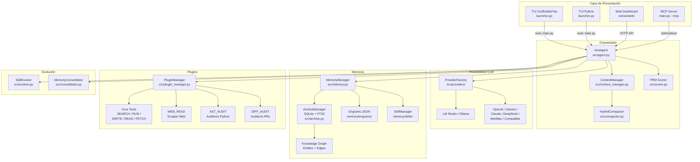

# Arquitectura de Anti

Anti es un agente autónomo de DevOps y Auditoría de Seguridad con arquitectura híbrida Go/Python, memoria persistente en SQLite FTS5, y un sistema de plugins dinámico.

---

## Diagrama de Arquitectura



---

## Flujo de Ejecución

### 1. Inicio

El usuario ejecuta el TUI (Go o Python), que presenta un menú interactivo. Al seleccionar "Ejecutar Anti", el TUI lanza `main.py` como subproceso.

`main.py` instancia `AntiAgent`, que:
1. Carga `config.json`
2. Selecciona el proveedor LLM (auto-detecta o usa el configurado)
3. Inicializa `MemoryManager` (SQLite + engrams JSON)
4. Inicializa `ContextManager` (ventana deslizante)
5. Inicializa `PluginManager` (carga plugins de `src/plugins/`)
6. Inicializa `PRMScorer` y `SkillEvolver`
7. Muestra el banner y el prompt interactivo

### 2. Procesamiento de un Mensaje

```
Usuario → AntiAgent._process()
  → MemoryManager.retrieve_omni_context()  # Memoria latente
  → build_system_prompt()                   # System prompt con contexto
  → Provider.chat()                         # Primera inferencia LLM
  → ReAct Loop (hasta 10 iteraciones):
      ¿El LLM invocó una herramienta?
        Sí → PluginManager.execute_tool()
           → retroalimentar resultado al LLM
        No → romper el loop
  → PRM Scorer (si activo):
      Score < 0.5 → refinamiento recursivo (hasta 2 intentos)
  → MemoryManager.log_experience()
  → Actualizar historial
  → Auto-reflexión (cada N tareas)
  → Devolver respuesta
```

### 3. Loop ReAct

El loop ReAct es el corazón del agente. El LLM genera texto y puede invocar herramientas con el formato `[NOMBRE: argumentos]`. El `PluginManager` detecta estas invocaciones, ejecuta la función registrada y retroalimenta el resultado al LLM para la siguiente iteración.

```
Iteración 1: LLM → [SEARCH: qué es Kubernetes]
  → PluginManager ejecuta búsqueda
  → Resultado vuelve al LLM

Iteración 2: LLM analiza resultados
  → [FETCH: https://kubernetes.io/docs/]
  → PluginManager obtiene contenido
  → Resultado vuelve al LLM

Iteración 3: LLM sintetiza → Respuesta final
  → Rompe el loop
```

---

## Interacción Go TUI ↔ Python Agent

### TUI en Go (Bubble Tea)

`launcher.go` compila a un binario `anti`. Usa:
- **Bubble Tea** — framework elm-arch para TUI
- **Lipgloss** — estilos y layouts
- **Bubbles/textinput** — entrada de texto para API keys

El TUI Go es puramente un **launcher/menú interactivo**. No contiene lógica de agente. Sus pantallas:

| Pantalla | Función |
| :--- | :--- |
| Menú Principal | 6 opciones: Terminal, Web, API Keys, Modelo, Setup, Salir |
| Conexiones API | Gestión de 6 proveedores cloud |
| Selección de Modelo | 9 proveedores (auto + 8 específicos) |
| Diagnóstico | Verifica archivos críticos |

### TUI en Python (Legacy)

`launcher.py` ofrece la misma funcionalidad en Python puro. Es el fallback si el binario Go no está compilado.

### Comunicación

Ambos TUIs lanzan el agente como **subproceso independiente**:

```go
// Go: lanza main.py y espera que termine
exec.Command(pythonPath, "main.py")
```

```python
# Python: lanza main.py y espera que termine
subprocess.run([sys.executable, "main.py"])
```

No hay comunicación bidireccional en tiempo real. El TUI lanza el agente, este corre en su propio proceso (stdin/stdout interactivo), y al terminar, el control vuelve al TUI.

### Para el modo Web

El TUI también puede lanzar `server.py`, que inicia un servidor HTTP con un dashboard web en el puerto 8000. El dashboard se comunica con el agente vía API REST.

---

## Arquitectura de Proveedores (LLM)

### BaseProvider (`src/providers/base.py`)

Clase abstracta que define la interfaz común:

```python
class BaseProvider(ABC):
    async def chat(self, messages, temperature) -> Tuple[str, Dict]
    async def list_models(self) -> List[Dict]
    async def sync_model_context(self)
    async def get_context_info(self) -> Dict
    async def check_connection(self) -> bool
```

Cada provider implementa estos métodos con la API específica del proveedor.

### ProviderFactory

El `ProviderFactory` utiliza **lazy imports** para no cargar todos los providers al inicio:

```python
PROVIDERS = {
    "lmstudio": None,
    "ollama": None,
    "openai": None,
    "gemini": None,
    "deepseek": None,
    "openaicompatible": None,
    "anthropic": None,
    "minimax": None,
}
```

`ProviderFactory.create(provider, **kwargs)` detecta si el provider ya fue importado; si no, hace el import y lo cachea.

### Auto-detección

`ProviderFactory.auto_create()` escanea puertos locales:
1. Prueba `http://127.0.0.1:1234/v1/models` (LM Studio)
2. Prueba `http://127.0.0.1:11434/api/tags` (Ollama)
3. Si no encuentra nada, fallback a LM Studio

### Cómo agregar un nuevo provider

1. Crear `src/providers/minuevo.py`:

```python
from .base import BaseProvider

class MiNuevoProvider(BaseProvider):
    DEFAULT_URL = "https://api.example.com/v1"
    DEFAULT_MODEL = "modelo-default"

    def __init__(self, base_url=None, model=None, timeout=120, api_key=None):
        super().__init__(base_url or self.DEFAULT_URL, model or self.DEFAULT_MODEL, timeout)
        self.api_key = api_key or os.environ.get("MI_KEY", "")

    async def chat(self, messages, temperature=0.7):
        # Implementar llamada a la API
        pass

    async def list_models(self):
        pass

    async def sync_model_context(self):
        pass

    async def get_context_info(self):
        return {"max": self.context_max, "usable": self.usable, "threshold": self.threshold}

    async def check_connection(self):
        pass
```

2. Registrar en `ProviderFactory`:

En `base.py`, agregar al diccionario `PROVIDERS`:
```python
"minuevo": None,
```

Y en `create()`:
```python
elif provider == "minuevo":
    from .minuevo import MiNuevoProvider
    cls.PROVIDERS[provider] = MiNuevoProvider
```

3. Agregar la opción en el TUI:

En `launcher.go`:
- Agregar campo en struct `Config`
- Agregar entrada en `ScreenModel`
- Agregar render en `View()`

4. Documentar el nuevo provider en `docs/config.md`.

---

## Memoria SQLite — Esquema y FTS5

### Archivo

`memory/cold_archive.db` — Base de datos SQLite con modo WAL (Write-Ahead Logging).

### Tablas

#### `engram_archive`

Engrams archivados (cold path). Cada fila representa una observación persistente.

| Columna | Tipo | Descripción |
| :--- | :--- | :--- |
| `id` | INTEGER PK | ID autoincremental |
| `topic` | TEXT NOT NULL | Tópico del engram |
| `content` | TEXT NOT NULL | Contenido completo |
| `timestamp` | TEXT NOT NULL | ISO 8601 |
| `importance_score` | REAL DEFAULT 0 | Score de importancia (0.0 - 5.0) |
| `tags` | TEXT | Tags separados por coma |
| `score` | REAL DEFAULT 1.0 | Score de acceso (se incrementa con cada acceso) |
| `last_accessed_at` | TIMESTAMP | Último acceso |

#### `log_history`

Historial de ejecuciones del agente.

| Columna | Tipo | Descripción |
| :--- | :--- | :--- |
| `id` | INTEGER PK | ID autoincremental |
| `timestamp` | TEXT NOT NULL | ISO 8601 |
| `task` | TEXT NOT NULL | Tarea ejecutada |
| `result` | TEXT | Resultado (truncado a 2000 chars) |
| `success` | INTEGER | 1 = éxito, 0 = fallo |
| `score` | REAL | Score del PRM Scorer |

#### `entities`

Nodos del Knowledge Graph.

| Columna | Tipo | Descripción |
| :--- | :--- | :--- |
| `id` | INTEGER PK | ID autoincremental |
| `observation_id` | TEXT | ID de la observación origen |
| `entity_type` | TEXT NOT NULL | Tipo: `keyword`, `file`, `url`, `package`, etc. |
| `value` | TEXT NOT NULL | Valor de la entidad |
| `timestamp` | TEXT NOT NULL | ISO 8601 |

#### `edges`

Relaciones del Knowledge Graph.

| Columna | Tipo | Descripción |
| :--- | :--- | :--- |
| `id` | INTEGER PK | ID autoincremental |
| `source_id` | INTEGER NOT NULL | FK → entities.id |
| `target_id` | INTEGER NOT NULL | FK → entities.id |
| `relation_type` | TEXT NOT NULL | `references`, `relates_to`, `follows`, `supersedes`, `contradicts` |
| `timestamp` | TEXT NOT NULL | ISO 8601 |

#### `engram_fts` (Virtual Table — FTS5)

Tabla virtual de búsqueda de texto completo sobre `engram_archive`.

| Columna | Tipo |
| :--- | :--- |
| `topic` | TEXT (indexed) |
| `content` | TEXT (indexed) |

La tabla se sincroniza automáticamente mediante triggers:

- `engram_ai` — AFTER INSERT → inserta en FTS
- `engram_ad` — AFTER DELETE → elimina de FTS
- `engram_au` — AFTER UPDATE → reemplaza en FTS

### Índices

| Nombre | Tabla | Columnas |
| :--- | :--- | :--- |
| `idx_entities_observation_id` | entities | observation_id |
| `idx_edges_source_id` | edges | source_id |
| `idx_edges_target_id` | edges | target_id |

### Búsqueda FTS5

El `ArchiveManager.search_archive()` construye una query OR de palabras para FTS5 y ordena por `bm25()`:

```sql
SELECT e.id, e.topic, e.content, e.timestamp, e.score, e.importance_score
FROM engram_archive e
JOIN engram_fts fts ON e.id = fts.rowid
WHERE engram_fts MATCH ?
ORDER BY bm25(engram_fts) LIMIT ?
```

### Knowledge Graph

El KG se construye automáticamente al guardar engrams:

1. **Extracción de keywords**: Las 5 palabras más frecuentes del contenido se guardan como entidades tipo `keyword`.
2. **Patrones especiales**: `TODO`, `BUG`, `DECISION`, `PATTERN` se extraen con sus respectivos tipos.
3. **Relaciones**: Se pueden crear edges entre entidades manualmente o mediante el paso `mem_relate()`.

El KG soporta consultas de grafo con **Recursive CTE** para traversal multi-nivel:

```sql
WITH RECURSIVE traversal(entity_id, current_depth, path) AS (
    SELECT id, 0, CAST(id AS TEXT) FROM entities WHERE observation_id = ?
    UNION ALL
    SELECT CASE WHEN e.source_id = t.entity_id THEN e.target_id ELSE e.source_id END,
           t.current_depth + 1, t.path || ',' || ...
    FROM edges e JOIN traversal t ON (...)
    WHERE t.current_depth < ? AND ...
)
SELECT entity_id, MIN(current_depth) as depth FROM traversal GROUP BY entity_id;
```

---

## Sistema de Plugins

Ver [`docs/plugins.md`](plugins.md) para la guía completa de desarrollo de plugins.

---

## PRM Scorer (Process Reward Model)

El `PRMScorer` evalúa la calidad de cada respuesta usando el mismo LLM como juez:

1. Construye un prompt de evaluación con la instrucción original y la respuesta.
2. Solicita un análisis breve y un score: `1` (bueno), `0` (parcial), `-1` (malo).
3. Si `prm_m > 1`, hace múltiples votaciones y aplica **mayoría simple**.
4. Si el score < 0.5, inicia un ciclo de refinamiento recursivo (hasta 2 intentos).

El scorer está optimizado para **máximo 50 tokens de salida** (elimina overhead de razonamiento del juez).

---

## ContextManager y Compactación

El `ContextManager` gestiona la ventana de contexto del LLM:

- **Provider-aware**: Local = 10 mensajes, Cloud = 100 mensajes (configurable).
- **Matriz de Integridad**: Safe (<50%) → Warning (50-85%) → Critical (85-95%) → Overflow (>95%).
- **Deduplicación Jaccard**: En nivel Warning, elimina mensajes redundantes (threshold 0.7). En Critical usa threshold 0.5 (más agresivo).
- **U-Shape Ordering**: Al compactar, preserva el inicio y final de la conversación.
- **Presión Adaptativa (Sentinel)**: Ajusta automáticamente la agresividad según la carga.

---

## Evolución Autónoma

El `SkillEvolver` analiza logs de experiencias para:

1. **Extraer Engrams** (conocimiento factual): Toma logs exitosos, los pasa por el LLM y extrae datos duros permanentes.
2. **Evolucionar Skills** (habilidades conductuales): Analiza logs fallidos, identifica patrones de error, y genera nuevas reglas de comportamiento.

El `MemoryConsolidator` ejecuta mantenimiento: decay de engrams viejos (>30 días sin uso), auto-purge de observaciones con bajo score, y síntesis de skills redundantes.
