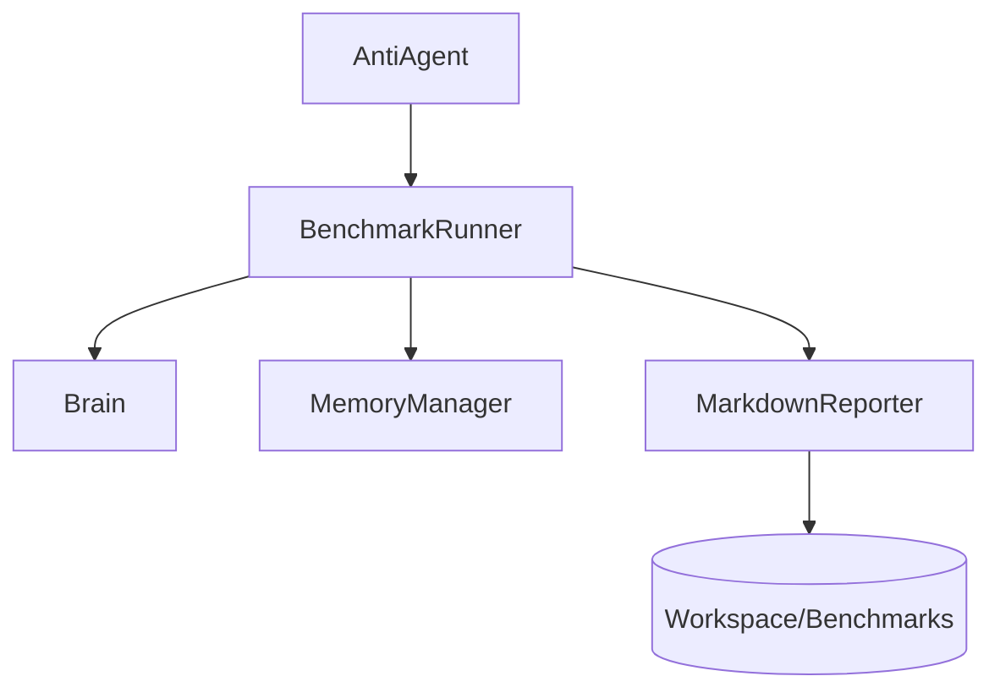
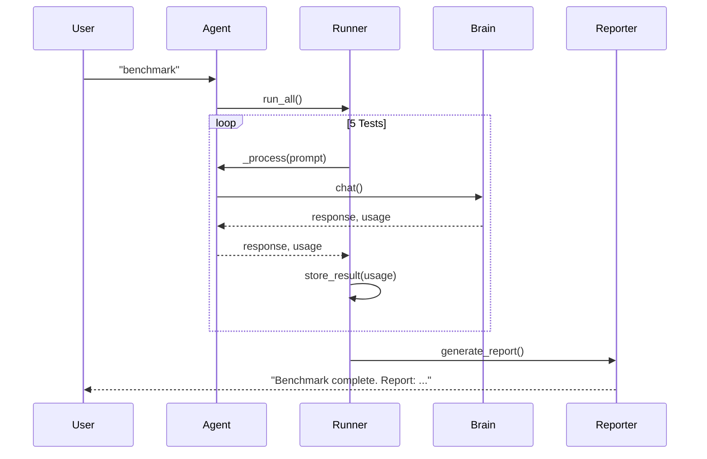

# Design: Sentinel Gauntlet Automation

## Architecture Decisions

- **Runner Location**: `Anti/core/benchmark.py`. This keeps the core logic separate from the agent's interaction loop.
- **Integration**: The `AntiAgent` will have a new method `run_benchmark()` that instantiates the runner.
- **Metric Extraction**: We will modify `Brain._chat_sync` to return the `tps` value so it can be captured by the runner. (Wait, `Brain` already calculates it but doesn't return it in the `usage` dict). I'll update `Brain` to include it.

## Component Diagram

## Detailed Design

### 1. Brain Enhancement
Modify `Brain._chat_sync` to include `tps` and `duration` in the returned `usage` dictionary.

### 2. BenchmarkRunner Class
- `run_all()`: Orchestrates the 5 tests.
- `execute_test(name, prompt)`: Runs a single test through `agent._process`.
- `capture_metrics(usage)`: Extracts tokens and timing.
- `generate_report()`: Formats results into Markdown.

### 3. Reporting
- Use a template for the report.
- Store results in `Anti/workspace/benchmarks/`.
- Maintain a `history.json` in that directory to facilitate comparisons.

## Sequence Diagram

## Affected Files

- `Anti/core/brain.py`: Add metrics to return value.
- `Anti/core/agent.py`: Add command handler for `benchmark`.
- `Anti/core/benchmark.py`: New file.
